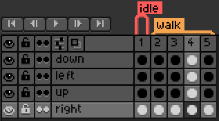

==================
Aseprite Animation
==================

This is a Python script made to handle Asesprite animations using Pygame.

Layers & Tags
-------------

The idea is that we have a player that can walk around in four different directions. We want the player to have a walking animation, but we dont want it to play if the player isn't moving. So that is why we have **tags**.

We can think of tags as another name for states. So while the player is moving, we would have the walking state active and if not, we would switch to the idle state. So if the player is walking and facing right, we would set the animations **tag** to **walk** and its **layer** to **right**.

**Note**: Unfortunately in **Aseprite v1.2.39** you cannot link cells due to a bug. If you try to export an animation with linked cells, the x & y coordinates in the "frame" tag in the JSON file will be incorrect. So if the animation is playing the wrong frames, double check that all your cells are unlinked.

Exporting
---------

While exporting, only two of the sections matter. You can use whatever settings you'd like in the **Layout** and **Borders** sections.

******
Sprite
******

All the settings must be exactly the same as the image below.

******
Output
******

**Output File** and **JSON Data** can be named whatever you'd like. All the other settings should look the same as the image below.

**Note**: You shouldn't manually edit the sprite sheet name after exporting because its filename is hard coded in the JSON file. So you would need to open the file and change the **"image"** tag in the **"meta"** section with the new filename. 

.. code-block:: text

  {layer} {tag} {frame}

Examples
--------
To see an example of the script working properly, you can run the demo.py file.